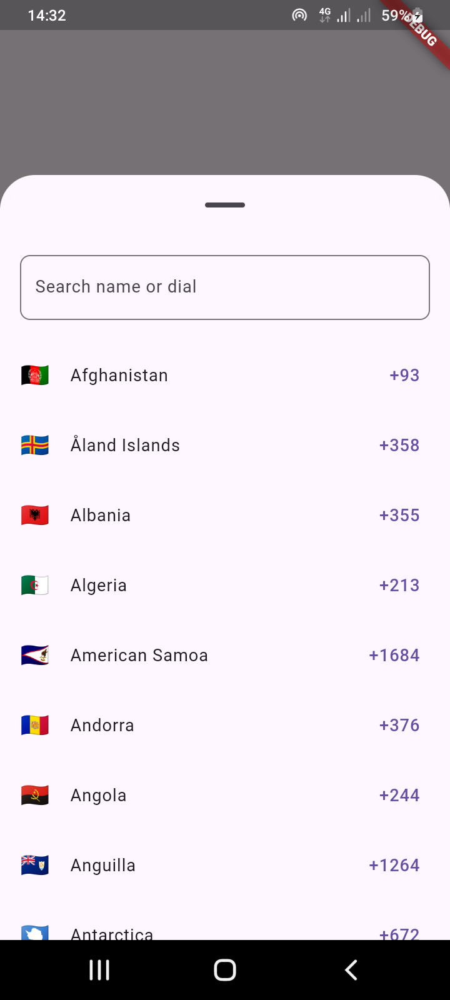
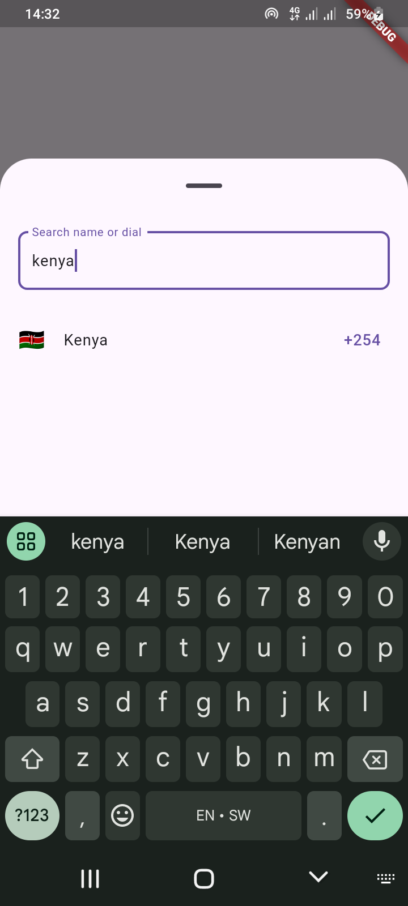
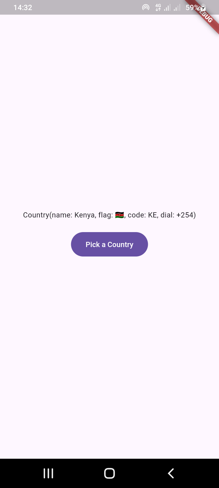

# EO Country Picker

A Flutter package that allows users to pick a country and retrieve its name, flag, ISO code, and dialing code. This package is perfect for apps that require users to input or select their country, such as phone number input fields.


## Features

- Retrieve country name, flag emoji, ISO code, and dialing code.
- Simple and easy-to-use API.
- Supports country selection and retrieval.
  
## Installation

```sh
flutter pub add eo_country_picker
```

## Import

```dart
import 'package:eo_country_picker/eo_country_picker.dart';
```

```dart
FilledButton(
    onPressed: () async {
    final result = await CountryPicker.open(context: context);
    if (result != null) {
        setState(() {
        _selectedCountry = result;
        });
    }
    },
    child: const Text("Pick a Country"),
),
```
## Screenshots

  <div style="border: 1px solid #ccc; padding: 1px; display: inline-block; margin-right: 10px;">
    <p style="text-align: center; margin-top: 10px; margin-bottom: 10px;">All Countries</p>
    
  </div>

  <div style="border: 1px solid #ccc; padding: 1px; display: inline-block;">
    <p style="text-align: center; margin-top: 10px; margin-bottom: 10px;">Search Results</p>
    
  </div>

  <div style="border: 1px solid #ccc; padding: 1px; display: inline-block;">
    <p style="text-align: center; margin-top: 10px; margin-bottom: 10px;">Picked Country</p>
    
  </div>

## Contributing

We welcome contributions from the Flutter community to further enhance and
improve our custom media picker. Whether it's bug fixes, feature enhancements,